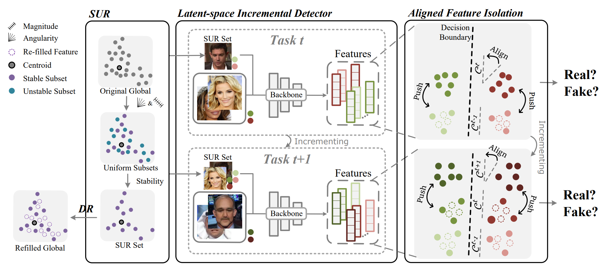

# SUR-LID
The official code for paper "[Stacking Brick by Brick: Aligned Feature Isolation for Incremental Face Forgery Detection](https://arxiv.org/pdf/2411.11396)" (CVPR 2025)



SUR-LID is implemented within the framework of [DeepfakeBench](https://github.com/SCLBD/DeepfakeBench). The provided code should be placed in the corresponding folders in DeepfakeBench. We do have made a new set of train_CL.py and datasets.py to align the paradigm of incremental learning, you may leverage our framework to train different incremental learning methods. 

## --- UPDATE ---
I have uploaded a preliminary version of the code, which may be relatively rough. All code should be integrated into the existing deepfakebench framework, adhering to its directory structure. You may run like:
```shell script
python training/train_CL.py --detector_path ./training/config/detector/CL_LID_effnb4.yaml 
--train_dataset "UADFV" "SDv21" --test_dataset "UADFV" "SDv21" 
--data_manner lmdb --task_target "CL_debug"
```

If any required packages are missing, please open an issue, and I will upload the necessary components that I neglected.

A more comprehensive and refined version of the code, along with detailed usage instructions, will be made available as soon as I got spare time.

<!-- ```python
python training/train.py 
--detector_path 
./training/config/detector/prodet.yaml 
--train_dataset 
"FaceForensics++"  
--test_dataset 
"FaceForensics++" "Celeb-DF-v2" "DFDCP" 
``` -->


You may cite our paper by:  
```bibtex
@article{cheng2024stacking,
  title={Stacking Brick by Brick: Aligned Feature Isolation for Incremental Face Forgery Detection},
  author={Cheng, Jikang and Yan, Zhiyuan and Zhang, Ying and Hao, Li and Ai, Jiaxin and Zou, Qin and Li, Chen and Wang, Zhongyuan},
  journal={arXiv preprint arXiv:2411.11396},
  year={2024}
}
```
